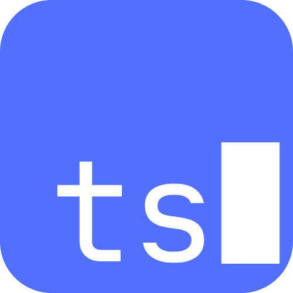

# Limbo

**Your downloads, on a leash.**

Limbo sits in your system tray and intercepts every file you download. Each file gets a countdown timer — act on it or let it disappear automatically. No more Downloads folder with 4,000 files you'll never open again.



---

## What it does

When a file lands in a watched folder (your Downloads folder by default), Limbo:

1. **Intercepts it** — moves the file into its own holding area before you can blink
2. **Starts a timer** — 5 minutes by default; the file is visible in the tray window with a countdown ring
3. **Gives you actions** — save it permanently, copy the path, open in Explorer, pin it to keep it, or just let the timer run out
4. **Deletes it** — automatically, when the timer hits zero, unless it's pinned

## Features

- **Per-file timers** — extend any file by +10 min or +1 hour with one click
- **Pin to keep** — pinned files never expire
- **Clipboard on arrival** — file path is copied automatically when a file is intercepted
- **Undo delete** — 5-second undo window after any deletion
- **Grid & list views** — toggle between layouts
- **Instant search** — filter by filename across all files in Limbo
- **Bulk actions** — select multiple files and delete, save, or unpin at once
- **Extension filters** — include or exclude specific file types
- **Image thumbnails** — inline previews for intercepted images
- **Sound on arrival** — optional chime when a file is intercepted
- **Startup launch** — runs with Windows, ready before your first download
- **100% local** — no cloud, no account, no telemetry

## Project structure

```
limbo/
├── electron-app/     # The Electron desktop app (Windows)
│   ├── electron/     # Main process: IPC handlers, file watcher, services
│   ├── src/          # React renderer: UI components, store, pages
│   └── resources/    # Icons and static assets
└── website/          # Promotional website (React + Vite)
    └── src/
        └── components/
```

## Development

### Prerequisites

- Node.js 18+
- Windows (the app is Windows-only; the website builds anywhere)

### Run the app

```bash
cd electron-app
npm install
npm run dev
```

### Run the website

```bash
cd website
npm install
npm run dev
```

### Build the app for distribution

```bash
cd electron-app
npm run build
```

This produces a distributable in `electron-app/dist/`.

## Tech stack

**App**
- [Electron](https://www.electronjs.org/) — desktop shell
- [React](https://react.dev/) + [TypeScript](https://www.typescriptlang.org/) — UI
- [Zustand](https://zustand-demo.pmnd.rs/) — client state
- [Chokidar](https://github.com/paulmillr/chokidar) — file system watching
- [Tailwind CSS](https://tailwindcss.com/) — styling
- [Vite](https://vite.dev/) — bundler

**Website**
- React + TypeScript + Vite + Tailwind CSS

## Contributing

See [CONTRIBUTING.md](CONTRIBUTING.md).

## License

MIT — see [LICENSE](LICENSE).
